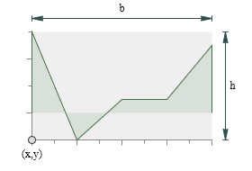
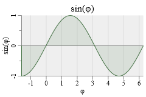

[](https://github.com/goessner/g2/license.txt)

# g2.chart

`g2.chart` is a [`g2`](https://github.com/goessner/g2) addon for generating simple x/y-line charts. 
Line charts are the most important charts from an engineer's point of view.

### Example: first chart


```html
<canvas id="c" width="250" height="175"></canvas>
<script src="./g2/g2.js"></script>
<script src="./g2.chart.js"></script>
<script>
  g2().cartesian()
      .chart({x:35,y:35,b:200,h:120,
              funcs:[{data:[-2,6,0,-2,2,1,4,1,6,5],fill:true}],
             })
      .exe(document.getElementById("c").getContext("2d"));
</script>
```
## Chart usage
`g2.chart` introduces a new `chart` command, which expects a single javascript object
specifying the chart properties. In order to use it you need to set `g2`'s 
cartesian flag. You will dimension the chart by specifying the lower left corner `x` and `y` 
as well as width `b` and height `h` of the rectangular chart area. 
Please note, that chart title, axis ticks, labels and titles are not included in that dimensions.



## Chart functions, range and style
Line charts display functional relations. These relations can be represented numerically via datasets or 
algebraic via functions. Both representations can be used by `g2.chart`. A single chart can contain multiple 
functions and even mix numerical and algebraic forms.

The chart x-value range is extracted from available datasets or must be explicitly specified. Its 
y-value range can be derived from both datasets and algebraic functions or - again - be explicitly 
set. 

### Example: multiple functions


```js
g2().cartesian()
    .chart({x:25,y:25,b:200,h:100,
            title:{text:"sine + tan"},
            xmin:-Math.PI/2,xmax:2*Math.PI,
            ymin:-3,ymax:3,
            funcs:[
              {fn:Math.sin,dx:Math.PI/30,fill:true},
              {fn:Math.tan,dx:Math.PI/90,fill:true}
            ]})
    .exe(ctx);
```

In this example the x-value range is explicitely set by `xmin` and `xmax`. It is valid then for all functions.
The y-value range is also explicitely set by `ymin` and `ymax`. That is done here only, because 
the `tan`-function has singularities at odd multiples of `pi/2`. So its chartis  simply clipped to the 
desired range of `[-3,3]`.

Please note that we didn't specify a color for displaying the functions in the last example. `g2.chart` provides a small set of 
default colors for sequentially assigning them to functions without explicite color definitions. If the function 
`fill` property is set to `true`, the function chart is filled with respect to the `zero` x-axis using 
its semi-transparent function color.

### Example: Axis properties


```js
g2().cartesian()
    .chart({ x:35, y:35, b:200, h:100,
             title: { text:"sin(φ)" },
             xmin:-Math.PI/2, xmax:2*Math.PI,
             funcs:[ { fn:Math.sin, dx:Math.PI/30, fill:true } ],
             xaxis: {
               title: "φ",
               grid: true,
               origin: true
             },
             yaxis: { title:"sin(φ)" }
           })
    .exe(ctx);
```

## Chart Properties

We can set some properties with x- and y-axis, as axis titles, grids and an explicite origin line.
It is also possible to suppress automatically defined axis ticks and labels. Custom labels are 
not implemented at current. 

You can overwrite the the default values, if you are not comfortable with them.

| Name | Type | Default | Description |
| --- | --- | --- | --- |
| `x` |`float` | - | x position of chart area's lower left corner. |
| `y` |`float` | - | y position of chart area's lower left corner. |
| `b` |`float` | - | breadth / width of chart area. |
| `h` |`float` | - | height of chart area. |
| `style` | `object` | `{ls:"transparent", fs:"#efefef"}` | chart border and area color style. |
| `title` | `string` or `object` | `null` | chart title string or object specifying title properties. |
| `title.text` | `string` | `null` | chart title string. |
| `title.offset` | `float` | `3` | vertical offset to chart area. |
| `title.style` | `object` | `{foc:"black", foz:16, thal:"center", tval:"bottom"}` | title style. |
| `funcs` | `array` | `[]` | array of datasets and / or functions. |
| `xaxis` | `object` | | x-axis properties. |
| `xaxis.style` | `object` | `{ls:"#888", thal:"center", tval:"top", foc:"black"}` | x-axis style. |
| `xaxis.title` | `string` or `object` | | x-axis title string or object specifying title properties. |
| `xaxis.title.text` | `string` | `null` | x-axis title string. |
| `xaxis.title.offset` | `float` | `1` | vertical x-axis title string offset. |
| `xaxis.title.style` | `object` | `{foz:12}` | x-axis title style. Not specified properties are inherited from `xaxis.style`. |
| `xaxis.line` | `boolean` | `true` | display x-axis base line. |
| `xaxis.origin` | `boolean` | `false` | display x-axis origin line. |
| `xaxis.ticks` | `object` |  | display x-axis ticks. Set to `false` to suppress.|
| `xaxis.ticks.len` | `float` | `6` | x-axis major ticks length. |
| `xaxis.grid` | `boolean` or `object` | `false` | display x-axis grid using style object. |
| `xaxis.labels` | `boolean` or `object` | | display x-axis labels. |
| `xaxis.labels.loc` | `'auto'` | `'auto'` | calculate x-axis labels automatically. |
| `xaxis.labels.offset` | `float` | `1` | vertical x-axis labels string offset. |
| `xaxis.labels.style` | `object` | `{foz:11}` | x-axis labels style. Not specified properties are inherited from `xaxis.style`. |
| `yaxis` | `object` | | y-axis properties. |
| `yaxis.style` | `object` | `{ls:"#888", thal:"center", tval:"bottom", foc:"black"}` | y-axis style. |
| `yaxis.title` | `string` or `object` | | y-axis title string or object specifying title properties. |
| `yaxis.title.text` | `string` | `null` | y-axis title string. |
| `yaxis.title.offset` | `float` | `2` | horizontal y-axis title string offset. |
| `yaxis.title.style` | `object` | `{foz:12}` | y-axis title style. Not specified properties are inherited from `yaxis.style`. |
| `yaxis.line` | `boolean` | `true` | display y-axis base line. |
| `yaxis.origin` | `boolean` | `false` | display y-axis origin line. |
| `yaxis.ticks` | `object` |  | display y-axis ticks. Set to `false` to suppress.|
| `yaxis.ticks.len` | `float` | `6` | y-axis major ticks length. |
| `yaxis.grid` | `boolean` or `object` | `false` | display y-axis grid using style object. |
| `yaxis.labels` | `boolean` or `object` | | display y-axis labels. |
| `yaxis.labels.loc` | `'auto'` | `'auto'` | calculate y-axis labels automatically. |
| `yaxis.labels.offset` | `float` | `1` | horizontal y-axis labels string offset. |
| `yaxis.labels.style` | `object` | `{foz:11}` | y-axis labels style. Not specified properties are inherited from `yaxis.style`. |

### Tests

See this growing table of [test cases](https://goessner.github.io/g2-chart/test/index.html) with canvas and svg output side by side.

## GitCDN
Use the link [https://gitcdn.xyz/repo/goessner/g2-chart/master/g2.chart.min.js](https://gitcdn.xyz/repo/goessner/g2-chart/master/g2.chart.min.js)
for getting the latest commit as a raw file.

In HTML use ...
```html
<script src="https://gitcdn.xyz/repo/goessner/g2-chart/master/g2.chart.min.js"></script>
```

# License
`g2.chart` is licensed under the terms of the MIT License.


# Change Log

## 0.2.0 - 2016-07-31
### Initial Commit

* `chart` command.
